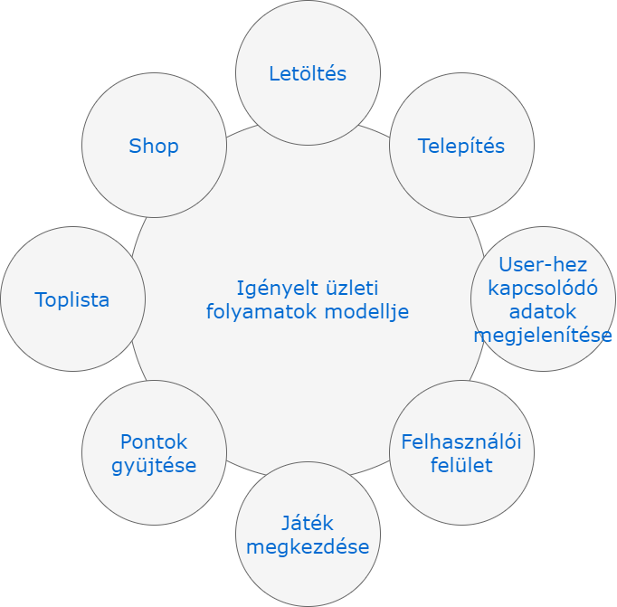
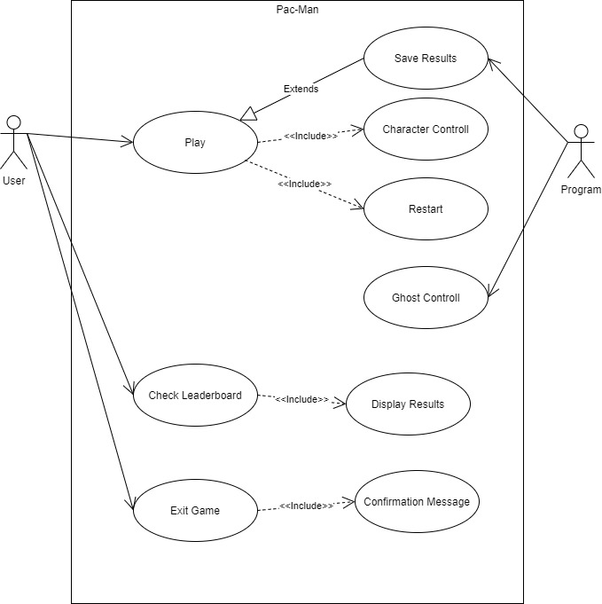
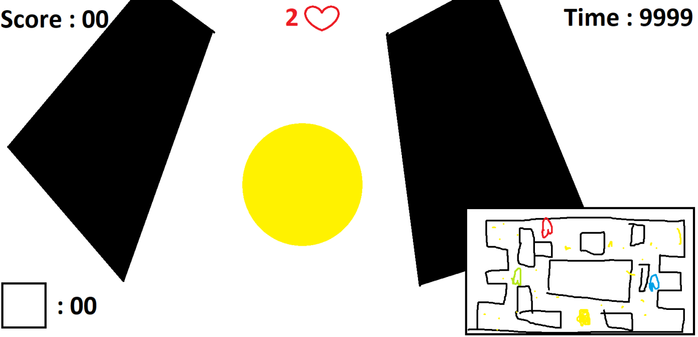
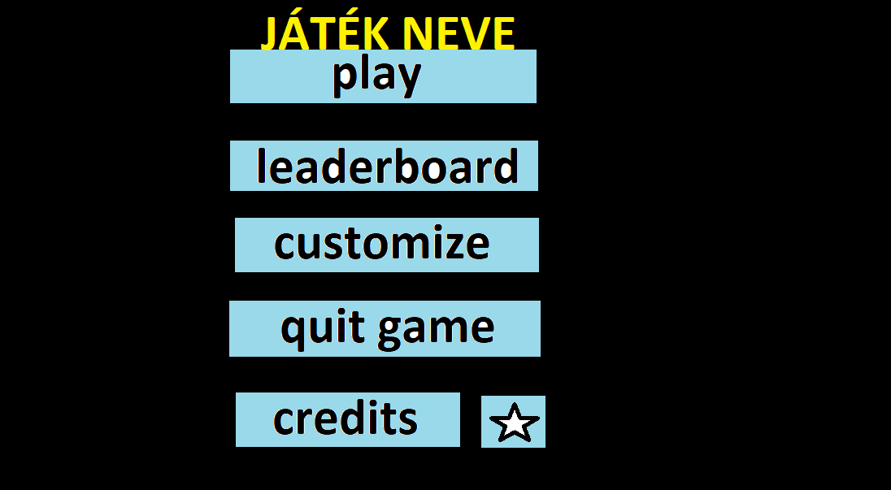
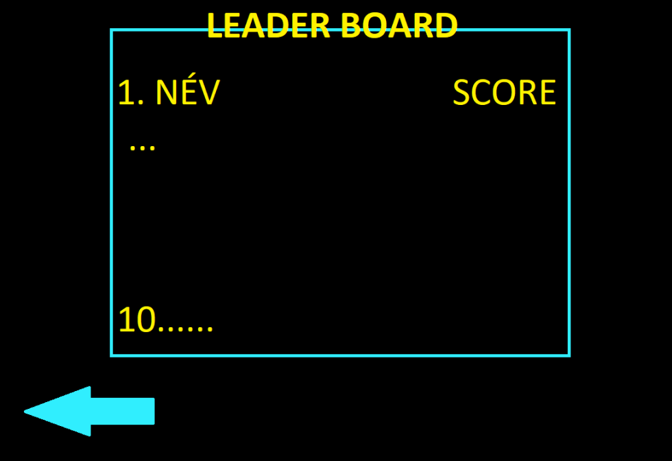
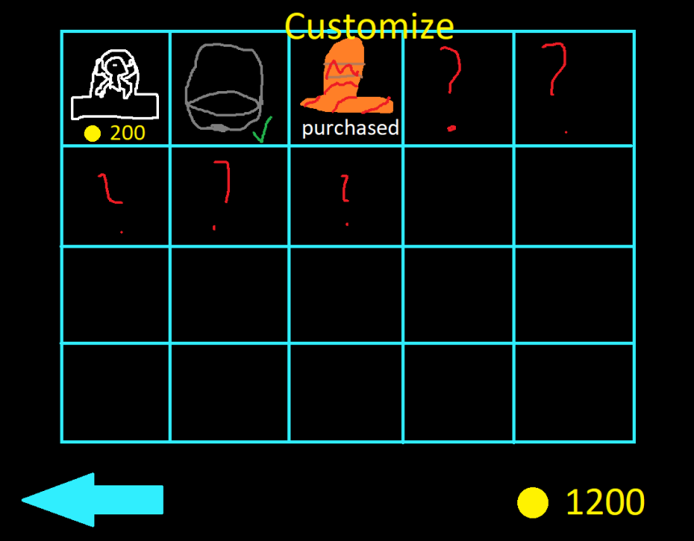

# A rendszer céljai és nem céljai
A rendszer célja a szórakoztatás, amit egy a Unity játékmotor segítségével készült Pac-Man játék fog lehetővé tenni. A játék nem bonyolult, a karaktert egy pályán navigálva kell felvenni érméket, miközben az ellenséget elkerülve vagy Power up segítségével legyőzve navigálunk, ezentúl lehet törekedni a lehető legtöbb pont elérése. Az elért pontszámokat automatikusan elmenti a program, ami később láthathó a toplistán is, tehát a játék egyfajta verseny ként is felfogható. Az összes érme felvétele után az érmék újra megjelennek tehát ekkor a játéknak nincs vége, növelhető tovább a pontszám, a játék akkor ér véget ha a három élet elfogy, ilyenkor új játékba kezdése vagy kilépés a menübe opció közül lehet választani. Nem egy újabb hagyományos 2D Pac-Man-t fog készíteni a csapatunk hanem egy 3D-ben kivitelezett Pac-Man-t fog létrehozni, mivel így minimálisan másabb élményt nyújt a felhasználónak, ezen felül új játék mechanikákkal is bővitve lesz az általunk készített Pac-Man videójáték amik tovább növelhetik a játék élményt.
# Jelenlegi helyzet
A Pac-Man a Namco játéka, amelyet 1980-ban adtak ki a játéktermekbe, és később különféle platformokra. Igazi klasszikussá vált, a világ egyik legismertebb játéka. A játék egy labirintusban játszódik, amelyben egy kis sárga fejet kell irányítani. A cél az, hogy a pontokat megegye, és elkerülje a négy szellem ellenséget, amelyek el akarják kapni Pac-Man-t. Már a bemutatásánál nagyon népszerű játék lett. Ebből adódóan az emberek többsége szívesen játszana egy új, modernebb verzióval, Ezen felül a fiatalabb korosztályok is megismerkedhetnek a Pac-Man fantasztikus világával.
# Vágyálomrendszer
A projekt célja egy 3D Pac-man megvalósítása, amely a felhasználók kikapcsolódását segít elő. Az alkalmazás Windows operációs rendszereken lesz elérhető. Az alkalmazás elindítása után egy színes menü oldal tárul a felhasználó elé, a menü oldalon történő navigáció egszerű a felhasználó élmények javítása érdekében. A menüben egy játék, egy toplista, egy shop és egy beállítások fül elérhető. A játék lehetőséget nyújtani a felhasználók teljesítményének tárolására (toplista), ennek segítségével másokkal is összemérhetik ügyességüket. A játék során elért pontjainkat fel tudják használni a gyüjthető kinézeti elemek megvásárlására, ezek a gyüjthető elemek cserélhetőek, hogy a saját karakterük kinézetét egyedivé tehessék vagy akár más pálya kinézettekkel is játszhassanak. A gyüjthető elemek sapkák különböző arcok és pálya kinézetek, amelyeket a shop-ban lehet megvenni a játékban szerzett pontokból, az értékük eltérő. A pontszámokat egy adatbázisban tárolja a rendszer, amelyben az adatfeltöltés során a játékosok saját nevet adhatnak meg, ideális esetben a felhasználók álltal megadott nevek egyediek lesznek, ezáltal az adatbázisban nem láthatjuk kétszer ugyan azt a nevet. A játék közben különböző power up-okat gyüjtenek mint például a gyorítás vagy akár a ghostokat is meg lehet majd enni ezek segítségével, a pálya ülönböző részein lesznek véletlenül elhelyezve. Pontokat minden megevett coin vagy ghost után fognak kapni a játékosok, a cél az összes pont összegyüjtése a ghostokat elkerülve.
# A rendszerre vonatkozó pályázat, törvények, rendeletek, szabványok és ajánlások felsorolása
Számítógépes aplikációként a következő szabványok vonatkoznak ránk.
## Általános szabványok
- Muszáj könnyen használhatónak lenni a célközönség számára.
- Logikusan kell működnie a célközönség számára.
- Haszálnia kell az iparág legjobb gyakorlatait.
## Fejlesztési technológia, Programozási nyelv
Az alkalmazás a következő(vagy fejlettebb) technológíákat használja:
- Unity
- C Sharp 8.0
Ajánlott fejlesztői környezet:
- Unity Editor
- Microsoft Visual Studio 2017 15.9.11
# Jelenlegi üzleti folyamatok modellje
A mai pac-man játékok nem használják ki a modern számítógépek nyújtotta lehetőségeket. Jelenleg sokan csak a régi 2D-s változatával játszanak amely manapság már elavultnak számít. Egy letisztultabb 3D-s változat nagyban javítaná a felhasználók játékélményét ezáltal nagyobb kikapcsolódást nyújtana a játék miként könnyebben megszabadulnának a mindennapi stressz okozta nyomástól. Mindemellet barátságos versengések is kialakulhatnak a felhasználók között, hogy ki is lehessen a ranglétra tetején.
# Igényelt üzleti folyamatok modellje

# Követelménylista
## Funkcionális:
- Mozgatás megtervezése és létrehozása
- Pontozási rendszer megtervezése és létrehozása
- Random pont generálása képernyőre
- Ellenség mozgása
- Játék mechanikák
## Nem funkcionális:
- Pálya megtervezése
- Grafikai elemek megtervezése
- Egyértelmű felhasználói felület megtervezése és létrehozása
- Adatbázis megtervezése és megvalósítása

| Modul       | Id | Név                    | Leírás                                           |
|:-----------:|:--:|:----------------------:|:------------------------------------------------:|
| Dizájn      | D1 | Grafikai elemek        | Grafikai elemek megtervezése és elkészítése      |
| Dizájn      | D2 | Felhasználói felület   | Felhasználói felület megtervezése és létrehozása |
| Dizájn      | D3 | Páya tervezés          | Pálya megtervezése és megvalósítása              |
| Játékmenet  | J1 | Irányítás              | Mozgatás implementálása                          |
| Játékmenet  | J2 | Pontozási rendszer     | Pontozási rendszer megvalósítása                 |
| Játékmenet  | J3 | Random pont generálás  | Random pont generálása a képernyőre              |
| Játékmenet  | J4 | Ellenség mozgása       | Ellenségek mozgásának megvalósítása              |
| Játékmenet  | J5 | Játék mechanikák       | Játékmechanikák megtervezése és létrehozása      |
| Adatbázis   | A1 | Adatbázis megtervezése | Adatbázis megtervezése és létrehozása            |
| Adatbázis   | A2 | Adatbázis kapcsolat    | Adatbázis kapcsolat létrehozása a játékban       |

# Használati esetek
A felhasználók a jéték indítása után a főmenübe kerülnek, ahol több lehetőségük van, a legelső lehetőség a játék indítása ami után a felhasználónak egy nevet kell megadnia, ha a nev megadásra került akkor a játékmenet indításra kész. A főmenüben továbbá megnézhetjük a legjobb elért pontszámokat, ezt úgy tehetjük meg ha a Ranglista menüpontott választjuk, ezenfelül lehetőségünk van a kilépésre a Kilépés gomb használatával.

# Megfeleltetés
Az alkalmazás főmenüjében a felhasználók különböző gombok segítségével tudnak majd navigálni, minden gomblenyomási eventhez hozzá lesz kötve, hogy egy új menü pontot töltsön be a következő menüpontok közül: shop, játék, ranglista vagy kilépés. 
A játék folyamán a játékosok pontokat kell, hogy gyüjtsenek, amely a pályán elhelyezett coinok segítségével fog történni, amint egy játékos áthalad a pályán elhelyezett coinok valamelyikén a pontok száma automatikusan fog nőni a pont számlálón, illetve a szert tesznek in-game valutára, amelyet majd a shopban tudnak elkölteni. 
A shopban a felhasználók a játék során megszerzett valutából különböző kinézeti elemeket tudnak majd venni. Amint a felhasználó megvesz valamit a shopban, a kinézeti elem id-je hozzá lesz rendelve a felhasználóhoz és onnantól kezdve a felhasználó számára véglegesen elérhetővé fog vállni. 
A ranglista a felhasználók álltal elért pontszámok listában rendezett rekordjait fogja számon tartani, a listából a saját vagy akár a mások álltal elért maximális pontszámot is meg tudják majd nézni. 
A kilépés gomb megnyomásakor az alkalmazás automatikusan be fog záródni és menti ez eddig elért teljesítményt, illetve a shopban megvásárol kinézeti elemeket is.
# Képernyőtervek

# Forgató könyvek
## Főmenü:
A játék indítása után a főmenübe tölt a program, ahol a felhasználó választhat a játék indítása, ranglista, kilépés opciók közül. A játék indítása opció választása után a játék kezdetét veszi. Ranglista opció választása esetén megnezhetjük a tíz legjobb elért pontszámot. Kilépés opciót választva a program futása befejeződik.
## Játékmenet:
A játék indítása opció választása után a játékmenet kezdetét veszi, először egy nevet kell megadnia a felhasználónak, ennek segítségével felkerülhet a ranglistára ha elegendő pontszámot ér el. A játékmenet egyszerű, a karakterünket irányítva kell a pályán navigálni úgy, hogy minnél több pontot tudjuk felvenni, miközben az ellenséget elkerüljük, vagy power-up segítségével elkapjuk őket. Ha a pályán lévő összes elhelyezett pontot felvettük, akkor a program ezeket vissza helyezei, ezáltal a játék folytatódhat az előzőleg leírt módon. Ha a szellemeket nem sikerül elkerülni, akkor a három életből egyet elveszít a felhasználó, ezen pontok elvesztése után véget ér a játékmenet. Ebben az esetben a felhasználó választhat a játék befejezése és új játék kezdése opciók közül. Játék befejezése opció választása esetén a pontszáma mentésre kerül ha jobb mint a legjobb tíz elért pontszám. Új játék kezdése opció esetén a játékmenet újra indul, a karakter és az ellenség a kezdő pozícióba kerül, a pontszám pedig nullázásra kerül.
## Ranglista:
A ranglista opció választása esetén, a program betölti a legjobb tíz elmentett pontszámot az adatbázisból, ezáltal megnézhető, hogy mennyi az elért legjobb tíz pontszám. Ebben a menüpontban lehetőség van a vissza lépés a főmenöben opció választására, ezáltal a felhasználó vissza kerül a főmenübe.
## Kilépés:
A kilépés opciót választva a program futása befejeződik, ezáltal a felhasználó vissza kerül az asztalára.
# Funkció-követelmény megfeleltetés
# Fogalomszótár
- Namco: Japán játékfejlesztői cég volt az 1980-as években.
- Unity: Vieójáték-motor aminek segítségével háromdimenziós illetve kétdimenziós videójátékokat, ezen kívül egyéb interaktív jellegű tartalmakat lehet létrehozni.
- Power-up: Videójátékokban felvehető segítség, amivel a karakterünk valamilyen módon erősebb lesz. Például: gyorsabb mozgásra képes.
- Microsoft Windows: a Microsoft Corporation gyártotta operációs rendszer.